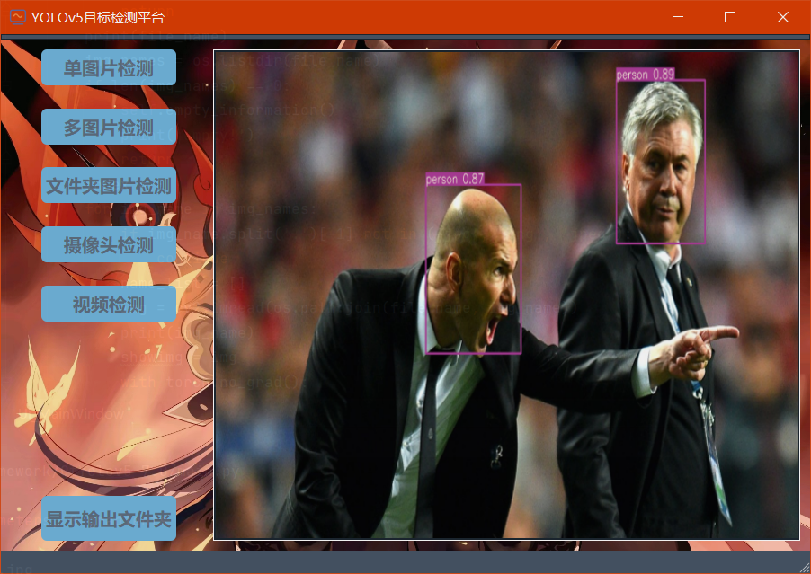

# YOLOv5-7.0版本配合PyQt5

## 介绍

本项目是基于 [ultralytics](https://github.com/ultralytics) 的 yolov5-7.0 版本配合 PyQt5 的可视化检测模型。



## 环境配置

- Python 3.7/3.8/3.9/3.10
- Pytorch 对应 ultralytics 的 yolov5-7.0 的版本
- 详细环境配置见`requirements.txt`
- PyQt5 使用了 qdarkstyle 的界面主题，可以通过`pip install qdarkstyle`安装 qdarkstyle

## 文件结构

```
  ├── images: 存放测试图片的文件夹，可以更改
  ├── models：存放主函数运行的一些依赖函数
  ├── result：保存检测结果的文件夹
  ├── UI：存放界面图标和背景图片的文件夹
  ├── utils：存放主函数运行的一些依赖函数
  ├── videos：存放测试视频的文件夹，可以更改
  ├── weights：存放模型权重的文件夹，可以根据自己训练得到的模型权重进行替换
  ├── export.py：导出模型文件，主函数运行依赖
  ├── main.py：运行的主函数
  └── requirements.txt：环境配置文件
```

说明：models、utils 文件夹中的一些文件可以进行删除，因为我是直接将 ultralytics 的 yolov5-7.0 版本中的 models、utils 文件夹直接复制过来，其中一些和训练有关的文件在这里并没有作用。

## 运行方式

直接运行`main.py`。

## 使用说明

- 单图片检测：一次只能检测一张图片。
- 多图片检测：一次可以选择多张图片进行检测。
- 文件夹图片检测：选择包含检测图片的文件夹进行检测，默认检测文件夹下的所有图片。
- 摄像头检测：打开摄像头/关闭摄像头。
- 视频检测：选择一个视频进行检测。
- 显示输出文件夹：显示保存检测结果的文件夹，默认为 result 文件夹下的 exp* 文件夹。

注意，这里对检测的图片类型做了限制，如默认只检测后缀为 .jpg、.png、 .jpeg 的图片，可以在`main.py`中修改限制。


**参考：http://t.csdn.cn/0CdXj**